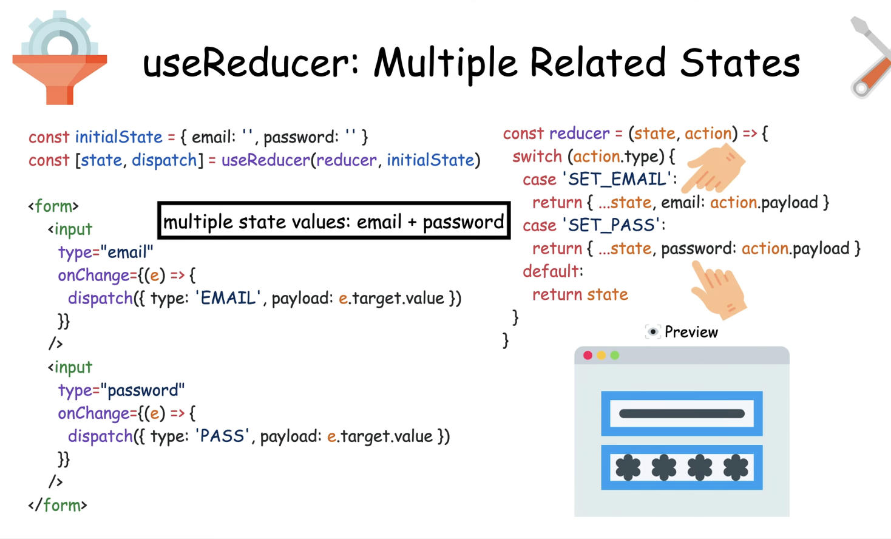

1) Hooks:
useState: Manages state in functional components.
the big advantage is to manage state and re -render when the state changes 
#syntax = const [age,setAge]=useState(42), first one is the state variable and the second one is the function to update the variable 
const [isVisible,setIsVisible]=useState(false)
<button onClick={()=>setIsVisible(!isVisible)}>
and the classic example is the count incrementer and decremeneter  !!!

useReducer: Manages complex state logic with a reducer function.
used for more complex states
useReducer uses the reducerfunction to update the state ,all the state updates can be done in a single function 
const reducer=(state,action)
=>{
    switch(action){
        case 'increment':
        return state+1
    }
}
<!-- takes the reducer function and initial state as params  -->
const [count,dipatch]=useReducer(reducer,0)
<button onClick={()=>dispatch('increment')}Increment<button/>
when dispatch is called it calls the reducer function
the benifit of action is to set the state conditionally based upon the action dispatched 
useReducer is used in case of multiple state values 

<!-- use effect hook  -->
useEffect: Handles side effects in functional components.
what is a side effect ?
lets us to synchronize with a outside system 
best example is to set the document title when we clicked on counter 
const [count,setCount]=useState(0)

useEffect(()=>{
    document.title=`you clicked ${count} times`
},[count])
<button onClick ={() => setCount(count+1)}>Click me <button/>
the function will run after each render 
the second argument is the dependency array which will make the useEffect run after each render 

there are two type of side effects 
1. event based(button click) 2.render based (fetching data using axios )
useEffect is asynchronous 

<!-- useRef: Creates a mutable object that persists between renders. -->
useRef refs let us remember data like useState , but dont trigger the re-renders 
const ref=useRef(0)
and to access the value we use ref.current 
another important property is ref are mutubale and states are immutable (cant modify them directly )
ref.current="something" 

<!-- useMemo: Memoizes values to optimize performance. -->
improve the app performance ,uses the concept of memoization by caching previous results 
calculates the values only when the dependencies changes 
good for the expensive computations 
useMemo is similar to useEffect but not the sideeffect ,must return a value
function SumComponent({numbers}){
    const sum=useMemo(()=>{
        return numbers.reduce((total,n)=>total+n,0)
    },[numbers]);
return <h1>sum:{sum}</h1>
}
<!-- 
reduce(accumulator,currentValue)
accumulator will add up the current element n and 0 is the initial value 
 -->
 array.reduce((acc, curr) => newAcc, initialValue)

useContext: Accesses the context in functional components.
useCallback: Memoizes callback functions to prevent unnecessary renders.

used for multiple fields like email ,password set_email ,set_password 

2) Higher Order Components (HOC):
What?: Functions that take a component and return an enhanced version.
When?: Reuse component logic, share code, or manipulate component behavior.
Why?: Promotes code reusability and separation of concerns.
How?: Wrap a component with a function that adds or modifies its behavior.

3) Life Cycle Methods of Components:
Class Components: Traditional React components using ES6 classes.
Mounting: Component is being created and inserted into the DOM.
Updating: Component is being re-rendered as a result of changes.
Unmounting: Component is being removed from the DOM.

4) State management (all about data):
State/Props: Internal state for a component/external data passed to a component.
Props drilling: Passing props through multiple layers of components.
Context: Provides a way to pass data through the component tree without passing props.

5) Redux or Zustand:
How redux works?: Centralized state management using actions and reducers.
Why?: For managing complex application states.
When?: In large applications with a need for a single source of truth.
Redux Toolkit (RTK): Simplifies Redux setup and usage.

6) Custom Hooks:
When to use?: Extracting and reusing component logic.
Code: Functions prefixed with "use" returning stateful logic.
Why?: Enhances code organization, reusability, and readability.

7) Lazy Loading:
Code splitting: Breaking down the application into smaller parts.
Chunking: Loading only the necessary code chunks.
Suspense: Pausing rendering until a component is ready.

8) Virtual DOM:
Reconciliation Algorithm: Efficiently updates the UI based on state changes.
React Fiber: A reimplementation of React's core algorithm.
Renders: The process of updating the virtual DOM.
Diff algorithm: Compares the previous and current state to determine changes.
How does render work?: Updating the UI based on virtual DOM changes.

9) SSR vs CSR (important):
What?: Server-Side Rendering vs. Client-Side Rendering.
Difference: Where rendering occurs - server or client.
SEO and performance (SSR): Improved search engine optimization and initial load speed.

10) Routing (Role-based access control-RBAC):
react-router: Library for handling navigation in React applications.
How do you manage protected routes?: Utilize authentication and authorization checks.
How do you handle routes?: Define routes and components for navigation.
Query params: Additional information passed in the URL.
Dynamic routing: Creating routes dynamically based on data.

11) Testing:
React Testing Library: Testing library for React applications.
Unit Testing: Testing individual units of code.
Hack for interview: Emphasize writing testable code and demonstrate test cases.

12) Async Tasks:
API Calls: Fetching data from external sources.
useEffect in depth: Managing side effects, including async operations.
Events: Handling asynchronous events.
Promises: A pattern for handling asynchronous operations.
setTimeout: Delaying the execution of code.

13) Reusability, Readability, modularity, testability (Coding Practices):

14) Performance:
Lazy loading: Loading resources only when needed.
Asset optimization: Minifying and compressing JS/CSS code.
Writing optimized code: Following best practices for efficient code.
Bundler: Tools like Webpack to bundle and optimize code.
CDN / Server level: Distributing assets for faster loading.
Rendering of components: Optimizing rendering for better performance.

15) Styling:
Tailwind, StyleX, Bootstrap, Material UI, Ant UI, CSS / SCSS: Different styling approaches and libraries.

